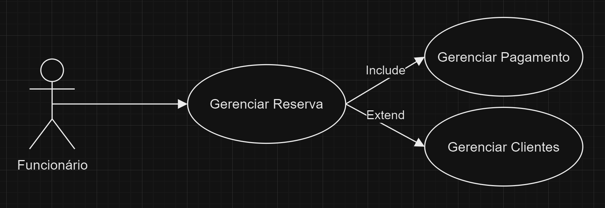

# 3. DOCUMENTO DE ESPECIFICAÇÃO DE REQUISITOS DE SOFTWARE

Nesta parte do trabalho você deve detalhar a documentação dos requisitos do sistema proposto de acordo com as seções a seguir. Ressalta-se que aqui é utilizado como exemplo um sistema de gestão de cursos de aperfeiçoamento.

## 3.1 Objetivos deste documento
O objetivo do LocaCar é simplificar e agilizar a interação entre clientes e locadoras, permitindo a busca, seleção e locação de veículos de forma intuitiva, segura e rápida, oferecendo opções de personalização, pagamento online e suporte integrado.

## 3.2 Escopo do produto

### 3.2.1 Nome do produto e seus componentes principais
O produto será denominado LocaCar. Será um sistema web voltado para o mercado de locação de veículos. 

### 3.2.2 Missão do produto
Integrar tecnologias inovadoras de desenvolvimento WEB e modelagem de processos, o LocaCar otimiza cada etapa do processo de locação, desde a reserva até a devolução do veículo, garantindo uma experiência fluida e sem complicações. 

### 3.2.3 Limites do produto
- Cobertura Geográfica: O sistema pode ter restrições geográficas, funcionando apenas em certas regiões ou países devido a requisitos legais ou de infraestrutura de internet.
- Suporte a Moedas e Idiomas: Pode haver limites na quantidade de moedas e idiomas que o software suporta, especialmente em operações multinacionais.
- Gestão de Frota: Pode haver um limite máximo de veículos cadastrados ou simultaneamente gerenciados pelo sistema.
- Reserva de Veículos: O sistema pode ter uma capacidade máxima de reservas simultâneas ou no período de tempo definido.
- Tipos de Veículos: Algumas soluções podem ser limitadas em relação à variedade de categorias e especificações de veículos que podem ser gerenciadas.
- Capacidade de Customização: O software pode ter limites na personalização de recursos, como fluxos de aprovação, taxas de aluguel ou requisitos específicos do cliente.

### 3.2.4 Benefícios do produto

| # | Benefício | Valor para o Cliente |
|--------------------|------------------------------------|----------------------------------------|
|1	| Facilidade no cadastro de dados |	Essencial |
|2 | Facilidade no processo de locação  | Essencial | 
|3 | Segurança nos dados dos clientes | Essencial | 
|4	| Interfaces amigáveis 	| Recomendável | 

## 3.3 Descrição geral do produto

### 3.3.1 Requisitos Funcionais

| Código | Requisito Funcional (Funcionalidade) | Descrição |
|--------------------|------------------------------------|----------------------------------------|
| RF1 | Gerenciar Reserva |	Processamento de efetuar, editar ou excluir uma reserva.| 
| RF2 |	Gerenciar Pagamento | Processamento da forma de pagamento, validação e aprovação.| 
| RF3 | Gerenciar Frota | Processamento de gerenciamento completo da frota, incluir e excluir veículos, quilometragem, modelo. | 
| RF4 | Validar Senha | Processamento de validação de senha no login. | 
| RF5 | Sair do Sistema | Processamento de Logoff do usuário do sistema | 
| RF6 | Gerenciar Clientes | Processamento de cadastro de clientes contendo nome, telefone, CPF/CNPJ e as demais informações pessoais. | 
| RF7 | Gerenciar Cadastro | Processamento de editar e excluir cadastros. | 
| RF8 | Gerenciar Seguros | Processamento de inclusão, exclusão e edição do seguro na locação do veículo. | 
| RF9 | Gerenciar Checklist | Processamento de inclusão, exclusão e edição do checklist do veículo. | 
| RF10 | Gerenciar Receitas | Processamento ao administrador a inclusão, exclusão e quitação de contas a receber. Além disso, deve ser permitido editar essas parcelas. | 
| RF11 | Gerenciar Funcionários | Processamento de inclusão, exclusão e edição de novos e atuais funcionários. | 
| RF12 | Gerenciar Usuários | Processamento de inclusão, alteração, consulta e bloqueio de usuário. | 
| RF13 | Gerenciar Relatórios | Processamento de gerar, editar, adicionar informações a relatórios. | 
| RF14 | Entrada no Sistema | Processamento de Login do usuário cadastrado. | 
| RF15 | Gerenciar Manutenção | Processamento de incluir, editar, excluir e programar manutenção nos veículos. | 
| RF16 | Gerenciar Fornecedores | Processamento de inclusão, alteração, consulta e exclusão de fornecedores. | 
| RF17 | Gerenciar Despesas | Processamento ao administrador a inclusão, exclusão e quitação de contas a pagar. | 
| RF18 | Gerenciar histórico de locação | Registrar e fornecer acesso ao histórico completo de locações realizadas por cada usuário. |
| RF19 |Gerenciar avaliações e feedback: | Permitir que os usuários avaliem os veículos e o serviço de locação, gerando relatórios de satisfação. |

### 3.3.2 Requisitos Não Funcionais

| Código | Requisito Não Funcional (Restrição) |
|--------------------|------------------------------------|
| RNF1 | Usabilidades: O sistema deve apresentar uma interface intuitiva e responsiva, adaptada para dispositivos móveis.  | 
| RNF2 | Manutenibilidade: O sistema deve ser modular e de fácil manutenção, permitindo atualização e correções de bugs sem grandes interrupções. | 
| RNF3 | Confiabilidade: O sistema deve funcionar na maior parte do tempo, com poucas interrupções ou falhas. | 
| RNF4 | Desempenho: Respostas em tempo real para consultas e reservas, com tempo de resposta inferior a 2 segundos. | 
| RNF5 | Permissões: Quem permissões de acesso a cada área do sistema. | 
| RNF6 | O sistema não deve permitir a exclusão de tipos de cobranças e recebimentos com vínculos. | 
| RNF7 | O sistema deve ter capacidade para recuperar os dados perdidos da última operação que realizou em caso de falha | 
| RNF8 | Autorização: O sistema deve garantir que usuários só acessem funcionalidades de acordo com seu nível de permissão. | 
| RNF9 | Segurança: Todos os dados pessoais e transações financeiras devem ser criptografados, com acesso restrito por autenticação. | 
| RNF10 | Disponibilidade: O sistema deve estar disponível 24/7, com uma janela de manutenção não superior a 2 horas por semana. | 
| RNF11 | Conformidade legal: O sistema deve estar em conformidade com as leis de proteção de dados, como a LGPD (Lei Geral de Proteção de Dados). | 
| RNF12 | Deve ser possível rastrear todas as alterações nos dados de reserva e cliente, incluindo histórico de transações. | 
| RNF13 | Suporte técnico: Deve garantir que os problemas reportados sejam resolvidos em até 48 horas após o chamado. | 
| RNF14 | Portabilidade: O sistema deve ser facilmente transferido para ambientes de nuvem como AWS, Azure ou Google Cloud. |
| RNF15 | Garantir acessibilidade: O sistema deve ser acessível a todos os usuários, incluindo pessoas com deficiência, seguindo as diretrizes de acessibilidade (WCAG).
| RNF16 | Garantir uso de padrões web: O sistema deve seguir as melhores práticas e padrões web, como HTML5, CSS3 e JavaScript moderno.

### 3.3.3 Usuários 

| Ator | Descrição |
|--------------------|------------------------------------|
| Clientes |	São os principais usuários do sistema de locação de veículos, realizando reservas, retiradas e devoluções de automóveis. |
| Funcionários  |	Incluem atendentes, agentes de locação, mecânicos e outros profissionais envolvidos na operação da locadora. Eles desempenham papéis cruciais na prestação de serviços de alta qualidade e no atendimento às necessidades dos clientes. |
| Gerentes e Supervisores |	Responsáveis pela supervisão e coordenação das atividades da locadora, garantindo o cumprimento de metas e a eficiência operacional. |

## 3.4 Modelagem do Sistema

### 3.4.1 Diagrama de Casos de Uso
Como observado no diagrama de casos de uso da Figura 1, a secretária poderá gerenciar as matrículas e professores no sistema, enquanto o coordenador, além dessas funções, poderá gerenciar os cursos de aperfeiçoamento.

#### Figura 1: Diagrama de Casos de Uso do Sistema (Funcionário).

#### Figura 2: Diagrama de Casos de Uso do Sistema (Gerente).

 
### 3.4.2 Descrições de Casos de Uso

Cada caso de uso deve ter a sua descrição representada nesta seção. Exemplo:

#### Gerenciar Professor (CSU01)

Sumário: A Secretária realiza a gestão (inclusão, remoção, alteração e consulta) dos dados sobre professores.

Ator Primário: Secretária.

Ator Secundário: Coordenador.

Pré-condições: A Secretária deve ser validada pelo Sistema.

Fluxo Principal:

1) 	A Secretária requisita manutenção de professores.
2) 	O Sistema apresenta as operações que podem ser realizadas: inclusão de um novo professor, alteração de um professor, a exclusão de um professor e a consulta de dados de um professor.
3) 	A Secretária seleciona a operação desejada: Inclusão, Exclusão, Alteração ou Consulta, ou opta por finalizar o caso de uso.
4) 	Se a Secretária desejar continuar com a gestão de professores, o caso de uso retorna ao passo 2; caso contrário o caso de uso termina.

Fluxo Alternativo (3): Inclusão

a)	A Secretária requisita a inclusão de um professor.  
b)	O Sistema apresenta uma janela solicitando o CPF do professor a ser cadastrado.  
c)	A Secretária fornece o dado solicitado.  
d)	O Sistema verifica se o professor já está cadastrado. Se sim, o Sistema reporta o fato e volta ao início; caso contrário, apresenta um formulário em branco para que os detalhes do professor (Código, Nome, Endereço, CEP, Estado, Cidade, Bairro, Telefone, Identidade, Sexo, Fax, CPF, Data do Cadastro e Observação) sejam incluídos.  
e)	A Secretária fornece os detalhes do novo professor.  
f)	O Sistema verifica a validade dos dados. Se os dados forem válidos, inclui o novo professor e a grade listando os professores cadastrados é atualizada; caso contrário, o Sistema reporta o fato, solicita novos dados e repete a verificação.  

Fluxo Alternativo (3): Remoção

a)	A Secretária seleciona um professor e requisita ao Sistema que o remova.  
b)	Se o professor pode ser removido, o Sistema realiza a remoção; caso contrário, o Sistema reporta o fato.  

Fluxo Alternativo (3): Alteração

a)	A Secretária altera um ou mais dos detalhes do professor e requisita sua atualização.  
b)	O Sistema verifica a validade dos dados e, se eles forem válidos, altera os dados na lista de professores, caso contrário, o erro é reportado.  
 
Fluxo Alternativo (3): Consulta

a)	A Secretária opta por pesquisar pelo nome ou código e solicita a consulta sobre a lista de professores.  
b)	O Sistema apresenta uma lista professores.  
c)	A Secretária seleciona o professor.  
d)	O Sistema apresenta os detalhes do professor no formulário de professores.  

Pós-condições: Um professor foi inserido ou removido, seus dados foram alterados ou apresentados na tela.

### 3.4.3 Diagrama de Classes 

Estrutura do Diagrama de Classes para LocaCar:
1.	Classe Reserva
o	Atributos: idReserva, dataReserva, status
o	Métodos: efetuarReserva(), cancelarReserva()
o	Relacionamentos:
	A Reserva está associada a um Cliente (quem realiza a reserva).
	A Reserva também está associada a um Veiculo (o carro reservado).
	Está conectada a um Pagamento, que é necessário para concluir a reserva.
2.	Classe Veiculo
o	Atributos: placa, modelo, quilometragem, status
o	Métodos: atualizarStatus(), registrarManutencao()
o	Relacionamentos:
	O Veiculo está ligado à Reserva, pois ele é o veículo que o cliente reserva.
	O Veiculo também está associado a Manutencao e Seguro para registrar reparos e garantir que o veículo esteja segurado.
3.	Classe Cliente (Herda de Usuario)
o	Atributos: nome, telefone, cpfCnpj
o	Métodos: realizarReserva()
o	Relacionamentos:
	O Cliente realiza uma Reserva.
	O Cliente está associado ao HistoricoLocacao, onde suas locações são registradas.
4.	Classe Funcionario (Herda de Usuario)
o	Atributos: idFuncionario, cargo
o	Métodos: gerenciarReservas(), gerenciarClientes()
o	Relacionamentos:
	O Funcionario gerencia as Reservas, realiza manutenções em Veiculos, e gerencia Clientes.
5.	Classe Pagamento
o	Atributos: idPagamento, valor, formaPagamento
o	Métodos: validarPagamento(), realizarPagamento()
o	Relacionamentos:
	O Pagamento está associado à Reserva, pois cada reserva exige um pagamento que deve ser validado e concluído.
6.	Classe Manutencao
o	Atributos: descricao, dataManutencao
o	Métodos: programarManutencao()
o	Relacionamentos:
	A Manutencao está associada ao Veiculo, para que seja possível registrar reparos e manter o histórico de manutenção.
7.	Classe Seguro
o	Atributos: tipoSeguro, valor
o	Métodos: incluirSeguro()
o	Relacionamentos:
	O Seguro está associado ao Veiculo, indicando que tipo de cobertura está disponível para aquele veículo.
8.	Classe HistoricoLocacao
o	Atributos: cliente, veiculo, dataLocacao
o	Métodos: registrarLocacao()
o	Relacionamentos:
	O HistoricoLocacao está ligado ao Cliente e ao Veiculo, registrando todas as locações feitas por um cliente.

Relacionamentos Passo a Passo

1.	Cliente realiza uma Reserva, que está associada ao Veiculo e precisa de um Pagamento para ser concluída.
2.	Funcionario pode gerenciar as Reservas e os Clientes.
3.	Veiculo tem um Seguro e também pode ser registrado para Manutencao.
4.	HistoricoLocacao mantém o registro de locações feitas, vinculando Cliente e Veiculo.
5.	Funcionario também é responsável por tarefas de Manutencao dos veículos e por gerenciar o processo de locação de forma geral.

